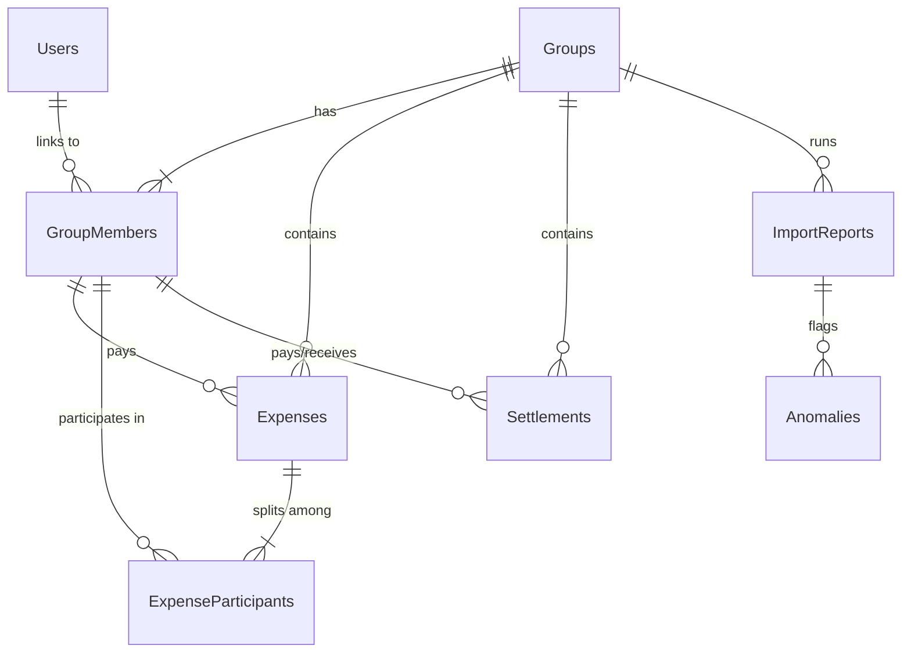

# Project Scope & Database Schema Specifications

## 1. CSV Import Engine & Anomaly Detection Scope

The CSV Import Engine parses `expenses_export.csv` files to import expenses and settlements in bulk. The system automatically detects and logs anomalies in the `ImportReports` and `Anomalies` tables. Below are the anomalies identified and the corresponding handling policies.

| Anomaly Type | Description / Matching Condition | Severity | Handling Policy & Action Taken |
| :--- | :--- | :--- | :--- |
| **Duplicate Expense** | Exact match of Date, Amount, Payer, Description, and Participant list against an existing DB record. | High | Flagged for review. Prevent automatically importing it, requiring manual approval to either ignore (delete draft) or force import. |
| **Negative Amount** | The expense amount is negative (e.g., `-500`). | Medium | Treated as a **Refund**. The direction of split balances is reversed (owed participants are credited, payer is debited). Normalized to a positive absolute amount for database storage and flag logged. |
| **Missing Currency** | The currency column is empty. | Low | Default to **INR**. Log warning, normalize, and continue import. |
| **Invalid Date** | Date format is not standard (e.g. DD/MM/YYYY, MM-DD-YYYY, or words). | Medium | Normalizes to `YYYY-MM-DD` using a parsing utility. If unparseable, flags as critical error and skips row. |
| **Settlement as Expense** | Expense with `Is Settlement = Yes` or a description indicating payment settlement (e.g. "Settled Alice to Bob"). | Medium | Automatically converted into a **Settlement** record. Bypasses expense participant split logic and registers as a direct settlement transfer. |
| **Unknown Participant** | Participant name is not in the group's current membership list. | Medium | Add as a **Guest Member** to the group automatically (with joinDate = expenseDate and leaveDate = null) and log a warning. |
| **Membership Violation** | Participant's joinDate is after the expense date, or leaveDate is before the expense date. | High | Flagged as violation. Skipped from import unless resolved by adjusting member dates or editing expense date. |
| **Malformed Split Info** | Split details like percentages not adding up to 100%, exact amounts not totaling expense sum, or negative weights. | High | Flags warning. Skips row or asks user to manually edit splits. |
| **Zero-Value Expense** | The expense has an amount of `0`. | Low | Logged as warning. Imported as a zero-value record (ignored for balance calculations). |
| **Currency Conversion Issue**| Invalid or missing exchange rate for USD/INR on transaction date. | High | Fallback to default static rate (1 USD = 83 INR) and record warning. |

---

## 2. Complete Database Schema

The relational MySQL database schema is structured as follows:

### Table Definitions

#### 1. Users
Stores registered users who can log in.
- `id` (INT, PK, Auto Increment)
- `name` (VARCHAR(100), Not Null)
- `email` (VARCHAR(150), Unique, Not Null)
- `password` (VARCHAR(255), Not Null)
- `createdAt` (DATETIME, Not Null)
- `updatedAt` (DATETIME, Not Null)

#### 2. Groups
Expense sharing groups (e.g., "Flat 4B").
- `id` (INT, PK, Auto Increment)
- `name` (VARCHAR(100), Not Null)
- `description` (TEXT, Null)
- `createdAt` (DATETIME, Not Null)
- `updatedAt` (DATETIME, Not Null)

#### 3. GroupMembers
Maps members to groups. Supports both registered users and guest members, with historical dates.
- `id` (INT, PK, Auto Increment)
- `groupId` (INT, FK -> Groups.id, Cascade Delete)
- `userId` (INT, FK -> Users.id, Nullable - for guest members)
- `name` (VARCHAR(100), Not Null - stores name for registered or guests)
- `joinDate` (DATE, Not Null)
- `leaveDate` (DATE, Nullable - null means active member)
- `isGuest` (BOOLEAN, Default: false)
- `createdAt` (DATETIME, Not Null)
- `updatedAt` (DATETIME, Not Null)
- *Index*: `groupId`, `userId`

#### 4. Expenses
Stores the primary expense records.
- `id` (INT, PK, Auto Increment)
- `groupId` (INT, FK -> Groups.id, Cascade Delete)
- `description` (VARCHAR(255), Not Null)
- `amount` (DECIMAL(15, 2), Not Null)
- `currency` (VARCHAR(3), Default: 'INR')
- `exchangeRate` (DECIMAL(10, 6), Default: 1.0)
- `amountInINR` (DECIMAL(15, 2), Not Null)
- `date` (DATE, Not Null)
- `paidById` (INT, FK -> GroupMembers.id)
- `splitType` (ENUM('EQUAL', 'PERCENT', 'EXACT', 'WEIGHT'), Not Null)
- `notes` (TEXT, Nullable)
- `createdAt` (DATETIME, Not Null)
- `updatedAt` (DATETIME, Not Null)

#### 5. ExpenseParticipants
Tracks who owes what for each expense.
- `id` (INT, PK, Auto Increment)
- `expenseId` (INT, FK -> Expenses.id, Cascade Delete)
- `memberId` (INT, FK -> GroupMembers.id)
- `shareAmount` (DECIMAL(15, 2), Not Null - share in INR)
- `sharePercentage` (DECIMAL(5, 2), Nullable)
- `shareWeight` (DECIMAL(10, 4), Nullable)
- `createdAt` (DATETIME, Not Null)
- `updatedAt` (DATETIME, Not Null)

#### 6. Settlements
Direct transfers between members.
- `id` (INT, PK, Auto Increment)
- `groupId` (INT, FK -> Groups.id, Cascade Delete)
- `payerId` (INT, FK -> GroupMembers.id)
- `receiverId` (INT, FK -> GroupMembers.id)
- `amount` (DECIMAL(15, 2), Not Null)
- `currency` (VARCHAR(3), Default: 'INR')
- `exchangeRate` (DECIMAL(10, 6), Default: 1.0)
- `amountInINR` (DECIMAL(15, 2), Not Null)
- `date` (DATE, Not Null)
- `notes` (TEXT, Nullable)
- `createdAt` (DATETIME, Not Null)
- `updatedAt` (DATETIME, Not Null)

#### 7. ExchangeRates
Caches currency exchange rates.
- `id` (INT, PK, Auto Increment)
- `fromCurrency` (VARCHAR(3), Not Null)
- `toCurrency` (VARCHAR(3), Default: 'INR')
- `rate` (DECIMAL(10, 6), Not Null)
- `date` (DATE, Not Null)
- `createdAt` (DATETIME, Not Null)
- `updatedAt` (DATETIME, Not Null)
- *Unique Index*: `fromCurrency`, `toCurrency`, `date`

#### 8. ImportReports
Tracks bulk file uploads.
- `id` (INT, PK, Auto Increment)
- `groupId` (INT, FK -> Groups.id, Cascade Delete)
- `fileName` (VARCHAR(255), Not Null)
- `status` (ENUM('PENDING', 'PROCESSED', 'FAILED'), Default: 'PENDING')
- `totalRows` (INT, Default: 0)
- `importedRows` (INT, Default: 0)
- `anomaliesCount` (INT, Default: 0)
- `createdAt` (DATETIME, Not Null)
- `updatedAt` (DATETIME, Not Null)

#### 9. Anomalies
Logs issues found in CSV import rows.
- `id` (INT, PK, Auto Increment)
- `importReportId` (INT, FK -> ImportReports.id, Cascade Delete)
- `rowNumber` (INT, Not Null)
- `rawData` (TEXT, Nullable - JSON of CSV row contents)
- `anomalyType` (VARCHAR(50), Not Null)
- `description` (TEXT, Not Null)
- `severity` (ENUM('LOW', 'MEDIUM', 'HIGH'), Not Null)
- `status` (ENUM('PENDING', 'APPROVED', 'IGNORED', 'RESOLVED'), Default: 'PENDING')
- `resolvedAction` (TEXT, Nullable)
- `createdAt` (DATETIME, Not Null)
- `updatedAt` (DATETIME, Not Null)

#### 10. AuditLogs
For security and tracking updates/deletions.
- `id` (INT, PK, Auto Increment)
- `userId` (INT, FK -> Users.id, Nullable - in case system actions occur)
- `action` (VARCHAR(100), Not Null)
- `details` (TEXT, Nullable)
- `createdAt` (DATETIME, Not Null)
- `updatedAt` (DATETIME, Not Null)
